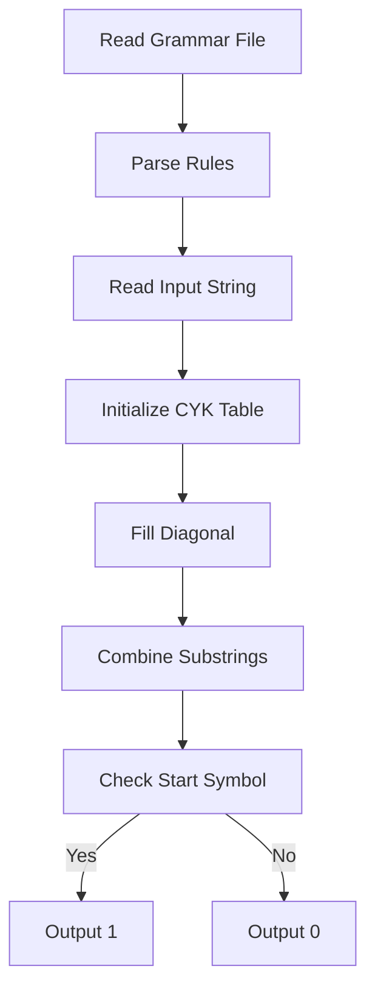

<<<<<<< HEAD
# CYK Parsing Algorithm Project

## Overview

This project implements the CYK (Cocke-Younger-Kasami) algorithm to check if an input string can be derived from a context-free grammar in Chomsky Normal Form (CNF) using dynamic programming.

## How to Run

```bash
python Project.py grammar.txt inputString.txt
```

- `grammar.txt`: Grammar in CNF.
- `inputString.txt`: String to check.
- Output written to `output.txt`.

## Program Structure

### Grammar Reading

- Grammar is parsed and separated into terminal and pair rules.
- Uses `defaultdict(set)` for efficient lookups.

### CYK Parsing

- Initializes a 2D DP table with sets for non-terminals.
- Fills diagonals using terminal rules, then combines substrings with pair rules.
- Checks start symbol in top-right cell for acceptance.

### Output

- Returns `1` if accepted, `0` if not.
- Outputs table in `output.txt` with sorted non-terminals; empty cells as `-`.

## Data Structures

- Grammar stored in `defaultdict(set)`.
- CYK table: 2D list of sets.

## Complexity

- Time: O(|G| × n³)
- |G|: Grammar size; n: string length.

## Workflow Diagram




=======
# CYK-Algo
>>>>>>> c6a4901c45f70860e1457c793024dfaa621d3493
